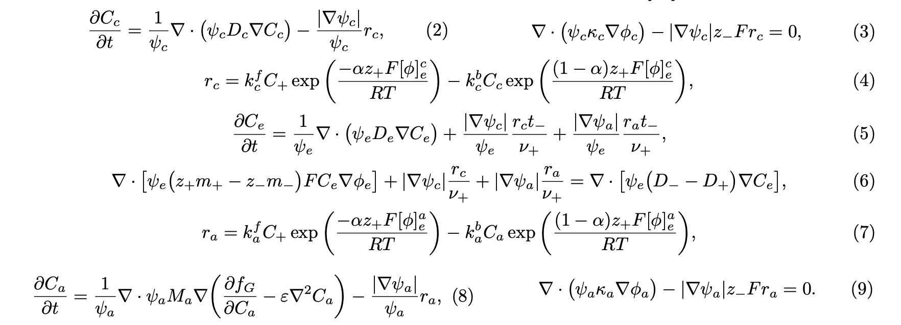

# BESFEM: Battery Electrode Simulation using MFEM

BESFEM is a high-performance, MPI-enabled electrochemical simulation framework for lithium-ion battery electrodes.  
It supports **half-cell** and **full-cell** simulations, **Cahn–Hilliard** and **diffusion-based** transport models, and the **Smoothed Boundary Method (SBM)** for diffuse interfaces.  
The code is written in C++ and built on top of the **MFEM** finite-element library.


---

## Project Structure

```
BESFEM/
│
├── include/             # Header files for physics modules
├── src/                 # Source files for all simulations
├── inputs/
│   ├── mesh/            # Mesh files
│   ├── distance/        # SBM distance fields
│   └── constants/       # Material + parameter files
│
├── outputs/
│   └── Results/         # Auto-generated simulation outputs
│
├── tests/               # Unit tests
├── plotting/            # Plotting files
└── bin/                 # Compiled executables
```

---

## Building BESFEM

Ensure MFEM, HYPRE, and MPI (OpenMPI or MPICH) are installed and available.

```bash
# clone the repository
git clone https://gitlab.msu.edu/hcy/besfem.git

# enter into besfem folder
cd besfem 

# On the HPCC 
module load MFEM

# compile all of the code - you may need to update  the makefile MFEM/HYPRE include + library paths as needed
make 

# enter folder with executable file
cd bin
```

---

## Running Simulations

### Full Cell Example
```bash
mpirun -np 8 ./battery_simulation \
    -mode full \
    -m ../inputs/mesh/Mesh_40x60x3_3D_disk_full.mesh \
    -dA ../inputs/distance/dsF_A_40x60x3_3D_disk_full.txt \
    -dC ../inputs/distance/dsF_C_40x60x3_3D_disk_full.txt \
    -t ml \
    -n 600
```

### Half Cell Example (Cathode)
```bash
mpirun -np 8 ./battery_simulation \
    -mode half \
    -elec cathode \
    -m ../inputs/mesh/Mesh_40x60_F00.mesh \
    -dC ../inputs/distance/dsFC_41x61_F00.txt \
    -t ml \
    -n 1200
```

### Half Cell Example (Cathode & TIFF)
```bash
mpirun -np 8 ./battery_simulation \
    -mode half \
    -elec cathode \
    -m ../inputs/II_1_bin.tif \
    -dC ../inputs/dummy.gf \
    -t v \
    -n 1200
```

### Half Cell Example (Anode)
The constants defined in `inputs/Constants.cpp` are configured for full-cell simulations by default. 
When running a half-cell anode simulation, some constants need to be modified to ensure correct reactions. 
Before running a half-cell anode simulation, please update the following values in `inputs/Constants.cpp`:

```bash
// -----------------------------------------------------------------------------
// Constants for half-cell simulation (anode side)
// -----------------------------------------------------------------------------

const double init_CnA = 2.0e-2;     ///< Initial lithium concentration in the anode
const double init_BvA = -0.1;       ///< Anode potential boundary condition (half-cell)
const double init_BvE = -0.4686;    ///< Electrolyte potential boundary condition (half-cell)
const double init_CnE = 0.001;      ///< Initial lithium concentration in the electrolyte
```

Now you can go ahead and run the example:

```bash
mpirun -np 8 ./battery_simulation \
    -mode half \
    -elec anode \
    -m ../inputs/mesh/Mesh_40x60_F00.mesh \
    -dA ../inputs/distance/dsFA_41x61_F00.txt \
    -t ml \
    -n 1200
```

---

## Command Line Options

| Option                  | Description                             |
| ----------------------- | --------------------------------------- |
| `-m <MeshFile>`         | Path to `.mesh` file                    |
| `-mode <half/full>`     | Select simulation mode                  |
| `-elec <anode/cathode>` | Required for half-cell mode             |
| `-dA <file>`            | Anode distance field (`.txt`)           |
| `-dC <file>`            | Cathode distance field (`.txt`)         |
| `-o <order>`            | Finite element polynomial order         |
| `-t <ml/v>`             | Mesh type: MATLAB (`ml`) or voxel (`v`) |
| `-n <steps>`            | Number of time steps                    |

---

## Generating Doxygen Documentation

```bash
module load Doxygen
doxygen Doxyfile
cd html
```
Preview doxygen locally:
```bash
python3 -m http.server 8000 --bind 127.0.0.1
```

---

## Plotting Using PyGLVis

```bash
pip install glvis
```

To plot, please reference the `pyglivs.ipynb` file within the `plotting` folder. 
You will need to adjust the input files of `mesh` and the `GridFunction x` that you are plotting. 

---

## Core BESFEM Equations



**Mass Matrix:** used for any term with a time derivative.
```bash
AddDomainIntegrator(new mfem::MassIntegrator());
```

**Stiffness Matrix:** used for PDE terms involving ∇.
```bash
AddDomainIntegrator(new mfem::DiffusionIntegrator());
```

**Linear System Assembly:** Produces `A * X = B`
```bash
FormLinearSystem(ess_tdof_list, x, b, A, X, B);
```


